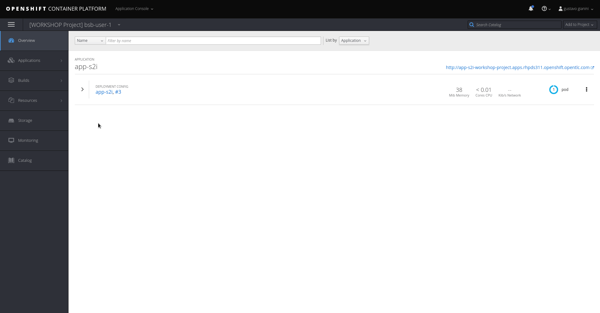
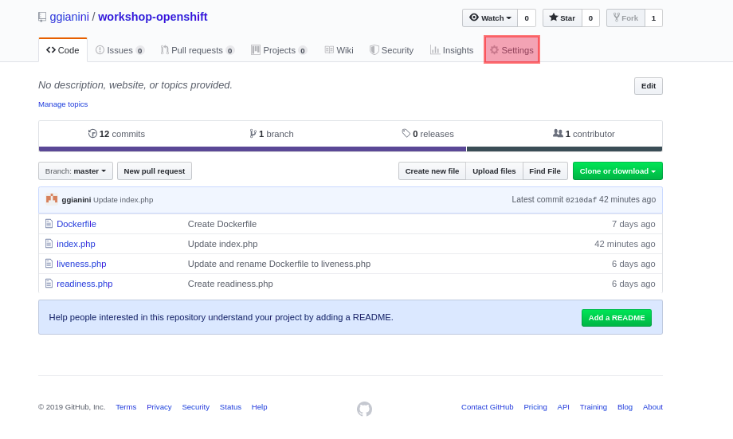
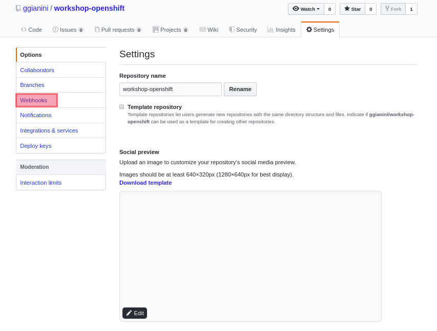
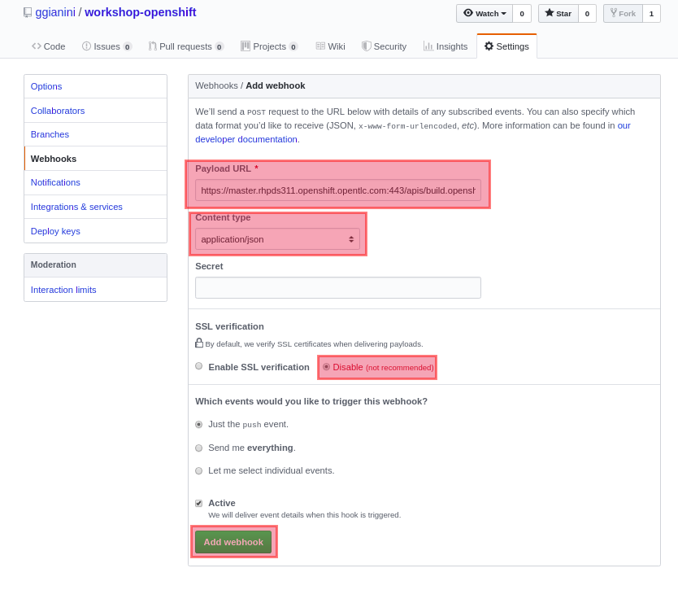
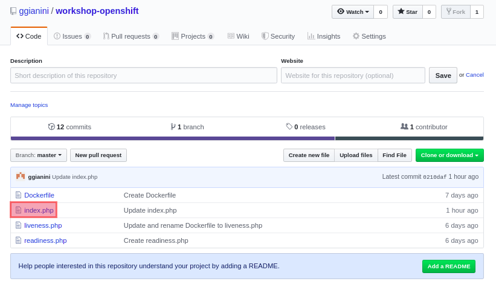
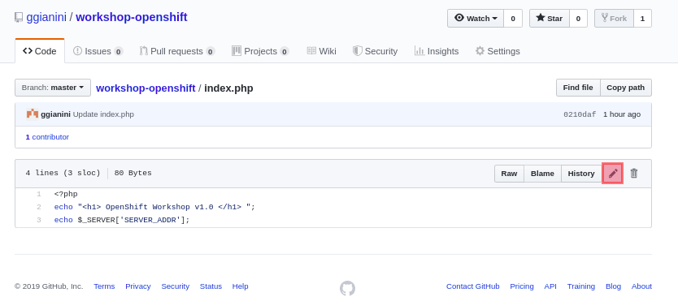
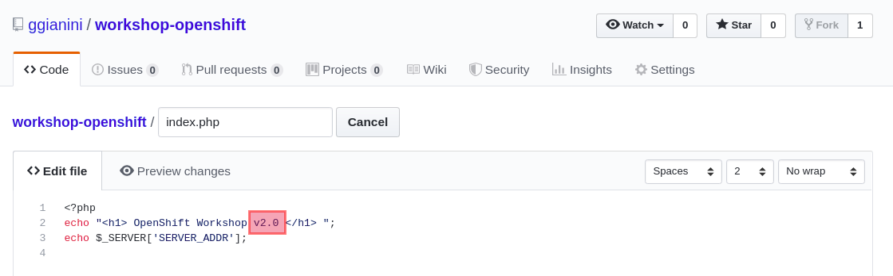
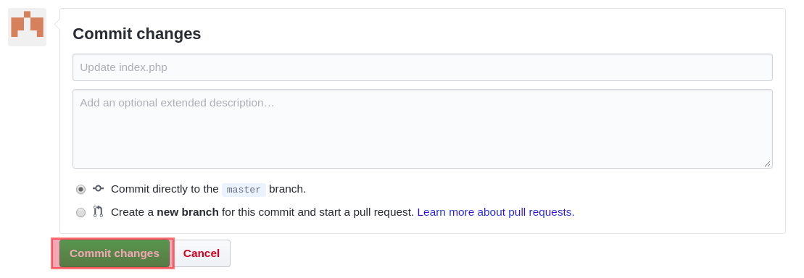
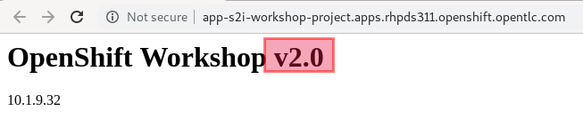

# 2.1.9 - Integração Contínua \(Webhook\)

Podemos automatizar o processo de build do nosso container toda vez que for feito push no nosso repositório git. Para isso, iremos configurar um `webhook`. Por meio dele, o servidor git avisará o Openshift sempre que um commit (push) novo ocorrer.

## Configuração webhook

Acesse a parte de Builds -> Builds

Depois selecione `app-s2i`

Clique em `Configuration` e copie o link do webhook clicando no icone a direita



No _Github.com_:

* Selecione `Settings` no menu horizontal



* Selecione o `Webhooks` no menu lateral esquerdo 



* Selecione `Add Webhooks`, cole a URL copiada no campo `Payload URL`, no campo `Content Type` selecione a opção `application/json`
* Clique em `Disable SSL verification`
* Finalize no botão `Add webhook`



## Altere a aplicação

### Usando a Web Console

Para fazermos uma alteração na aplicação, vamos alterar a versão na página inicial da aplicação.

Clique no `Index.php`



Depois clique no lápis para editar



No `index.php`, altere a linha com a versão da aplicação para versão 2.0.



```text
echo "<h1>Openshift Workshop v2.0</h1>";
```
Clique em `Commit changes` logo abaixo



### Usando a linha de comando

Podemos fazer o processo de commit e push por meio da linha de comando do git:

> Só execute esse passo caso você não tenha feito o commit usando a página do github

```bash
git add index.php
git commit -m "webhook adicionado"
git push
```

## Acompanhe o rolling deployment

Observe que não ocorre indisponibilidade durante o deployment

Verifique que a versão foi alterada na rota exposta



### Mais informações

* [https://docs.openshift.com/container-platform/3.11/dev\_guide/migrating\_applications/web\_hooks\_action\_hooks.html](https://docs.openshift.com/container-platform/3.11/dev_guide/migrating_applications/web_hooks_action_hooks.html)
* [https://docs.openshift.com/container-platform/3.11/dev\_guide/builds/triggering\_builds.html](https://docs.openshift.com/container-platform/3.11/dev_guide/builds/triggering_builds.html)
* [https://docs.openshift.com/container-platform/3.11/getting\_started/developers\_console.html\#developers-console-configure-auto-builds](https://docs.openshift.com/container-platform/3.11/getting_started/developers_console.html#developers-console-configure-auto-builds)

