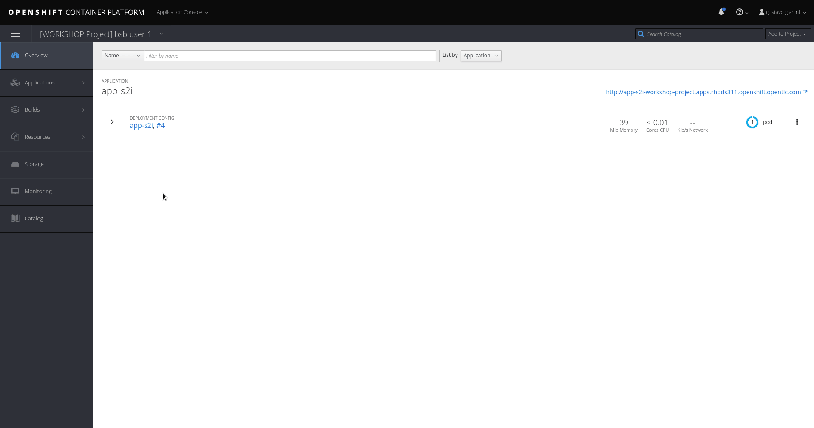

# 2.1.10 - Agregação de Logs

Devido a facilidade de criar e escalar aplicações, torna-se praticamente impossível rastrear algum erro de forma individual procurando em cada container. Para resolver este problema o Openshift possui uma solução de agregação de logs baseada no ElasticSearch, Fluentd e Kibana \(EFK\). O acesso aos logs é feito através da console gráfica do Kibana.

## Na console do Openshift

* Navegue até a tab de logs de um dos pods.
* Selecione a opção `Archive`

são as mesmas utilizadas para acessar o console do OpenShift desse workshop: 

Login: userXX
Senha: OpenShift 

Siga os passos do vídeo asseguir para acessar o console do Kibana (agregador de logs) no seu browser.

As credenciais de acesso ao console do Kibana 

Abaixo segue destaque de onde devemos clicar:

Assim que acessar, a tela do Kibana estará semelhante a foto abaixo:

É possível criar relatórios e consolidar em dashboards, com informações mostrando o crescimento de erros da aplicação `x` nos últimos meses ou semanas, etc...

## Mais informações:

* [https://docs.openshift.com/container-platform/3.11/install\_config/aggregate\_logging.html](https://docs.openshift.com/container-platform/3.11/install_config/aggregate_logging.html)
* [https://blog.openshift.com/splunk-connect-for-openshift-logging-part/](https://blog.openshift.com/splunk-connect-for-openshift-logging-part/)
